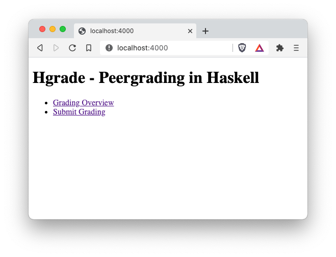
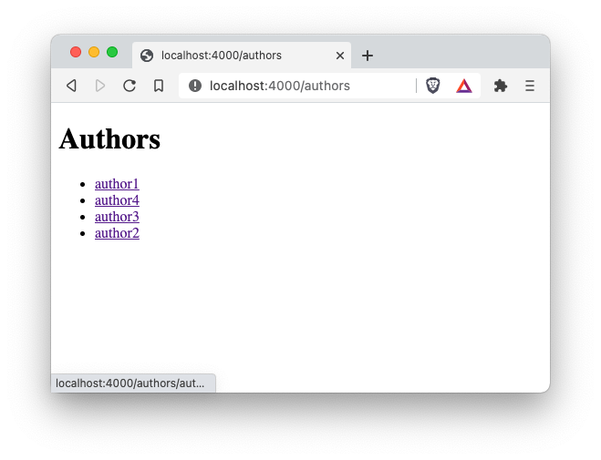
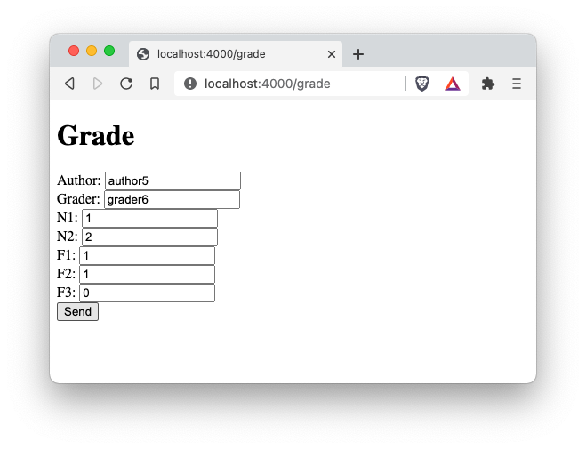
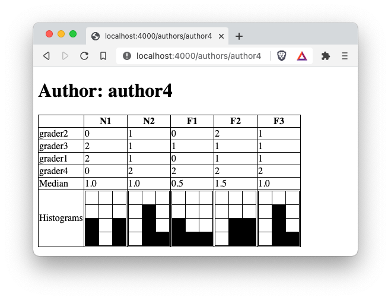
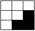

# fprog Programmierprojekt HS20

## Thema
In diesem Programmierprojekt implementieren Sie eine kleine Webapplikation für Peergrading in Haskell.


<p>Abbildung 1: Startseite</p>


<p>Abbildung 2: Übersicht</p>


<p>Abbildung 3: Bewerten</p>


<p>Abbildung 4: Auswerten</p>

## Spezifikation der Anwendung
Dieses [Video](https://tube.switch.ch/videos/efac9155) erklärt die Funktionalität der Applikation.

### Ansichten
- **Startseite:** Erreichbar über GET http://localhost:4000/
- **Übersichtsseite:** Erreichbar über GET http://localhost:4000/authors
- **Bewertungsseite:** Erreichbar über GET http://localhost:4000/grade (Daten schicken mit POST auf diese Adresse)
- **Auswertungsseite:** Erreichbar über GET http://localhost:4000/authors/AUTHOR_NAME

### Datenhaltung
Die Daten werden im Dateisystem abgelegt. Die Namen der Autoren sind dabei direkt Ordnernamen. Die Namen der Grader sind in die Dateinamen codiert und haben zusätzlich eine `.txt` Datei-Erweiterung.
Es folgt ein Beispiel der erklärten Struktur:
```
> tree data              
data
├── author1
│   ├── grader1.txt
│   └── grader2.txt
├── author2
│   ├── grader1.txt
│   ├── grader2.txt
│   └── grader3.txt
├── author3
│   └── grader2.txt
└── author4
    ├── grader1.txt
    ├── grader2.txt
    ├── grader3.txt
    └── grader4.txt

4 directories, 10 files
```

Die Grader Dateien enthalten die vergebenen Punkte in folgendem Format:
```
> cat data/author1/grader1.txt 
[0,1,0,2,0]
```
Hinweis: Die `Show` und `Read` Instanzen für `[Int]` können verwendet werden. 

Sie können annehmen, dass die vergebenen Punkte immer `0`, `1` oder `2` sind. Sie müssen das nicht überprüfen.

Die 5 Kriterien in den Demodaten heissen `N1`, `N2`, `F1`, `F2` und `F3` in dieser genannten Reihenfolge.

`grader1` hat also den `author1` mit folgenden Punkten bewertet:
`N1`=`0`, `N2`=`1`, `F1`=`0`, `F2`=`2`, `F3`=`0`.

Im `data.zip` Archiv sind die oben erklärten Demo-Daten enthalten.

## Rahmenbedingung
- Dieses Projekt ist eine **Einzelarbeit**. Gemäss Prüfungsordnung resultiert ein Verstoss gegen diese Bedingung mit der **Note 1**.
- Das Projekt muss mit GHC 8.8.4 und Cabal 3.2.0.0 gebaut und gestartet werden können.
- Es dürfen keine zusätzlichen Libraries verwendet werden.

## Aufgaben

### 1. `studentinfo.txt` Datei bearbeiten und ins Repo stellen
Schreiben Sie Ihre FHNW-Email-Adresse in die Datei `studentinfo.txt`. Sonst soll in dieser Datei kein weiteres Zeichen stehen. **Commiten und pushen** Sie diese Änderung anschliessend. Tun Sie das bitte gleich jetzt!

### 2. Applikation implementieren
Die Applikation soll dieselbe Funktionalität haben, wie im Video gezeigt. Die Darstellung darf ansprechender gestaltet werden. Das wird allerdings nicht bewertet.

Hier ein Vorschlag, wie Sie die Aufgabe angehen könnten:

1. Implementieren Sie die Startseite, damit Sie schnell ein Erfolgserlebnis haben.
2. Implementieren Sie die Übersichtsseite, die für jeden Ordner im `data` Verzeichnis einen Link auflistet.
3. Implementieren Sie die Auswertungsseite für einen Autor. Lassen Sie dabei Median und Histogramm noch weg.
4. Implementieren Sie das Formular, um Bewertungen abzugeben.
5. Fügen Sie schrittweise Median und die Histogramme der Auswertungsseite hinzu.
6. Teilen Sie den Code auf Module auf, schreiben Sie Kommentare und Tests, etc.

Ich empfehle regelmässig zu commiten und auf Github zu pushen und nicht erst am Schluss.

### Hinweis zum Arbeitsaufwand
Das Lösen dieser Aufgabe entspricht dem Arbeitsaufwand für zwei Wochen im Modul fprog, also in etwa einer Arbeitszeit von **12 Stunden**. Das ist eine Schätzung - beginnen Sie besser frühzeitig mit der Arbeit.


## **Bewertung**
In diesem Projekt sind 320 Punkte erreichbar.

### **Nicht Funktionale Anforderungen (140 Punkte)**
**(N1)** Die Applikation kann mit GHC 8.8.4 und Cabal 3.2.0.0 gebaut und gestartet werden. Dazu wird folgendes Kommando verwendet: `cabal run hgrade`
- Nein (-50Pt)
- Ja (0Pt)

**(N2)**  Die Tests können mit GHC 8.8.4 und Cabal 3.2.0.0 gebaut und gestartet werden und sind alle `OK`. Dazu wird folgendes Kommando verwendet: `cabal run hgrade-test`
- Nein (-50Pt)
- Ja (0Pt)

**(N3)** Die Autorin / der Autor bleibt anonym. Es stehen also keine Hinweise auf den Autoren wie Namen, E-Mail-Adressen etc. in den Artefakten. Einzige Ausnahme bei der Abgabe ist das `studentinfo.txt`.
- Nein, ist nicht anonym (-50pt)
- Ja, ist anonym (0Pt)

**(N4)** Jede toplevel Deklaration (inkl. Modul) hat einen Kommentar:
- Nein (0Pt)
- Ja (10Pt)

**(N5)** Jede toplevel Deklaration hat eine Typsignatur:
- Nein (0Pt)
- Ja (20Pt)  

**(N6)** Die Funktionalität ist auf mindestens drei Module verteilt (exklusiv app/Main.hs):
- Nein (0Pt)
- Ja (20Pt)

**(N7)** Es sind mindestens **je** zwei Tests für die Funktionen `median`, `histogram` und `colsToRows` vorhanden. Details zu den Funktionen finden Sie unten bei den Hinweisen. 
- Nein (0Pt)
- Ja (20Pt)
  
**(N8)** Art der Html Generierung:
- Es wird kein Html im Code generiert oder Html wird durch direkte Stringkonkatenation mit (++) oder concat auf [String] generiert (0Pt):
    ```haskell
    concat ["<body>", "<h1>", title, "<\h1>", "<p>", text, "</p>", "</body>"]
    ```
- Html wird mit Hilfsfunktionen (hier im Beispiel `body`, `h1` und `p`) erzeugt (30Pt):
    ```haskell
    body [ 
      h1 [title],
      p [text]
    ]
    ```

**(N9)** Die Bezeichnungen der Kriterien (und somit auch deren Anzahl) sind
- im Html fix codiert (0Pt)
- in einer Konstante als Liste von Strings gespeichert und das Html für das Formular und die Auswertungsseite wird darauf basiert generiert (40Pt)
  
Um dieses Kriterium zu prüfen (am besten als letztes) gehen Sie wie folgt vor: 
1. `data` Ordner löschen
2. In der Liste ein bestehendes Kriterium umbenennen und ein neues hinzufügen. 
3. Applikation neu bauen und starten. Die vorgenommenen Anpassungen müssen sowohl im Formular wie auch auf der Übersichtsseite ersichtlich sein.


----
### **Funktionale Anforderungen (180Pt)**

#### **Startseite**

**(F1)** Die Startseite enthält einen funktionierenden Link zur Übersicht:
- Nein (0Pt)
- Ja (5Pt)

**(F2)** Die Startseite enthält einen funktionierenden Link zum Grading Formular:
- Nein (0Pt)
- Ja (5Pt)

#### **Übersichtsseite**
**(F3)** Die Übersichtsseite zeigt funktionierende Links zu den Auswertungsseiten der erfassten Autoren (Ordnernamen im `data` Ordner):
- Nein (0Pt)
- Ja (10Pt)

#### **Auswertungsseite**
**(F4)** Die Auswertungsseite zeigt den Namen des Autors:
- Nein (0Pt)
- Ja (10Pt)

**(F5)** Die Auswertungsseite zeigt für jede Bewertung den Namen des Graders an:
- Nein (0Pt)
- Ja (10Pt)

**(F6)** Die Auswertungsseite zeigt für jede Bewertung die vergebenen Punkte des Graders an:
- Nein (0Pt)
- Ja (10Pt)

**(F7)** Die Auswertungsseite zeigt für jedes Kriterium den korrekten Median an:
- Nein (0Pt)
- Ja (20Pt)

**(F8)** Die Auswertungsseite zeigt für jedes Kriterium das Histogramm an:
- Nein (0Pt)
- Ja (40Pt)

#### **Bewertungsseite**
**(F9)** Die Bewertungsseite zeigt ein Formular mit Input Feldern und zugehörigen Labels für Autor, Grader und die Kriterien sowie ein Submit Button:
- Nein (0Pt)
- Ja (30Pt)

#### **Grading: Bestehender Autor, bestehender Grader**
**(F10)** Wenn Werte für ein bestehender Autor und ein bestehender Grader abgeschickt werden, wird die bestehende Textdatei mit den vergebenen Punkten überschrieben:
- Nein (0Pt)
- Ja (10Pt)
  
#### **Grading: Bestehender Autor, neuer Grader**
**(F11)** Wenn Werte für ein bestehender Autor und ein neuer Grader eigegeben werden, wird eine neue Textdatei mit den vergebenen Punkten unter dem entsprechenden Ordner erstellt und das neue Grading wird für den entsprechenden Autor auf der Auswertungsseite dargestellt:
- Nein (0Pt)
- Ja (10Pt)

#### **Grading: Neuer Autor, neuer Grader**
**(F12)** Wenn Werte für ein neuer Autor und ein neuer Grader eigegeben werden, wird ein neuer Ordner für den Autor sowie eine neue Textdatei mit den vergebenen Punkten unter dem neuen Ordner erstellt, der neue Autor erscheint auf der Übersichtsseite und das neue Grading wird für den entsprechenden Autor auf der Auswertungsseite dargestellt:
- Nein (0Pt)
- Ja (10Pt)

#### **Demo Daten**
**(F13)** Wenn die Applikation mit dem Commandline Argument `-demo` gestartet wird, also `> cabal run hgrade -- -demo`, werden automatisch Demo Daten erzeugt.
- Nein (0Pt)
- Ja (20Pt)
Um dieses Kriterium zu prüfen, wird der `data` Ordner gelöscht und die Applikation mit dem oben genannten Kommando gestartet. Es müssen mindestens 3 Ordner für die Autoren mit jeweils mindestens einer Textdatei für einen Grader erstellt werden. Die Inhalte der Textdateien müssen zufällig erzeugt werden. Das prüfen Sie durch Inspektion des Sourcecodes oder indem Sie diesen Test zweimal durchgeführen und die Textdateien vergleichen.

## Abgabe der Arbeit
Abgabetermin: **Samstag, 12.12.2020 23:59 Uhr**

Die Abgabe der Arbeit findet über ein `git commit` und ein anschliessendes `push` statt. Die GIT-Commit-Message dieses letzten Commits soll `Abgabe EN2 <Ihre-FHNW-Mail-Adresse>` lauten. Stellen Sie sicher, dass Ihre Mail-Adresse korrekt ist! Bitte kontrollieren Sie vor der Abgabe, dass alle Artefakte eingechecked und vorhanden sind. Die Abgabe findet wie üblich über den Master-Branch statt.

## Hinweise

### **Arbeiten mit Pfaden**

Das Typalias `FilePath` ist ein Alias für den Typ `String`. Pfade auf Dateien und Ordner können Sie also leicht aus `String`s zusammenbauen. Als Pfadseparator verwenden Sie bitte alle `"/"`, auch auf Windows. Alle Pfade sollten relative zum Wurzelverzeichnis des Projekts sein. Wenn Sie absolute Pfade verwenden, wird das bei anderen Studierenden dann nicht funktionieren. 

### **Arbeiten mit `IO a` und `ActionM a`**

Folgende Funktion könnten sich als nützlich erweisen:
```haskell
import Control.Monad (mapM, replicateM, forM_)

mapM :: (a -> m b) -> [a] -> m [b]
mapM_ :: (a -> m b) -> [a] -> m () -- wie mapM, ignoriert das Resultat, aber hat die Effekte

replicateM :: Int -> m a -> m [a]
```

Das `m` kann dabei für `IO` oder auch `ActionM` stehen. So können Sie z.B. drei Strings von der Konsole einlesen:

```haskell
threeStrings :: IO [String]
threeStrings = replicate 3 getLine
```
----
#### **Arbeiten mit Verzeichnissen**
Wir verwenden Funktionen aus dem Package [directory](https://hackage.haskell.org/package/directory-1.3.6.1/docs/System-Directory.html) um Verzeichnisse zu erzeugen und deren Inhalte aufzulisten.
Die Funktionen sind im Modul `System.Directory` und müssen entsprechend importiert werden.

----
#### **Arbeiten mit Zufallszahlen**
Wir verwenden Funktionen aus dem Package [random](https://hackage.haskell.org/package/random-1.2.0/docs/System-Random.html) um Zufallszahlen zu erzeugen. So können Sie eine `Int` Zufallszahl im Intervall [0,2] erzeugen:
```haskell
randomRIO (0,2) :: IO Int
```
Die Funktion ist im Modul `System.Random` und muss entsprechend importiert werden.

----
#### **Statistische Funktionen**
Die Funktion `median` um den [Median](https://en.wikipedia.org/wiki/Median) zu berechnen, müssen Sie selbst implementieren.
Um eine Liste zu sortieren, können Sie die `sort` Funktion aus `Data.List` verwenden.
Sie können davon ausgehen, dass immer mindestens eine Bewertung pro Autor vorhanden ist.

Die Funktion `histogram` soll eine Liste der Punkte nehmen und die Informationen zur Konstruktion des Histogramms zurückgeben. Wie erwähnt sind pro Kriterium `0`, `1` oder `2` Punkte möglich.
Eine einfache mögliche Signatur wäre `histogram :: [Int] -> (Int, Int, Int)`.

----
#### **Listen von Listen von Zeilen nach Spalten umformen**
Sie implementieren folgende Funktion:
```haskell
colsToRows :: [[a]] -> [[a]]
```
Beispiel:
```haskell
g1 = [a1,b1,c1] -- Grader g1 gibt der Studierenden a1, b1, c1 Punkte
g2 = [a2,b2,c2] -- Grader g2 gibt der Studierenden a2, b2, c2 Punkte
-- Für das 1. Kriterium bekommt die Studierende [a1,a2] Punkte, für das 2. Kriterium [b1,b2] Punkte etc.
colsToRows [g1, g2] == [[a1,a2], [b1,b2], [c1,c2]]
```

----
#### **Arbeiten mit Modulen**
Zusätzliche Module müssen im `hgrade.cabal` File unter `library` `->` `exposed-modules:` hinzugefügt werden. Sonst scheitert `gcc` in der Linker Phase:

```
ld: symbol(s) not found for architecture x86_64
clang: error: linker command failed with exit code 1 (use -v to see invocation)
`gcc' failed in phase `Linker'. (Exit code: 1)
```
----
#### **Html für Anfänger**
Folgende Seite konsultiere ich regelmässig, wenn ich Html schreiben muss: https://www.w3schools.com/

- [Basics](https://www.w3schools.com/html/html_basic.asp)
- [Links](https://www.w3schools.com/html/html_links.asp)
- [Listen](https://www.w3schools.com/html/html_lists.asp)
- [Tabellen](https://www.w3schools.com/html/html_tables.asp)
- [Formular](https://www.w3schools.com/html/html_forms.asp)

Halten Sie das Html einfach, das ist keine Web-Vorlesung.

----
#### **Html Historgramme**
Die Histogramme können Sie als Html Tabellen abbilden. Folgendes Histogramm 



ist mit dem folgenden Code Fragment als Html Tabelle beschrieben:

```html
<style>
table, th, td {
    border: 1px solid black;
    border-collapse: collapse;
}
</style>

<table>
  <tr>
    <td bgcolor="white" style="height:20px;width:20px"></td>
    <td bgcolor="white" style="height:20px;width:20px"></td>
    <td bgcolor="white" style="height:20px;width:20px"></td>
  </tr>
  <tr>
    <td bgcolor="white" style="height:20px;width:20px"></td>
    <td bgcolor="white" style="height:20px;width:20px"></td>
    <td bgcolor="black" style="height:20px;width:20px"></td>
  </tr>
  <tr>
    <td bgcolor="white" style="height:20px;width:20px"></td>
    <td bgcolor="black" style="height:20px;width:20px"></td>
    <td bgcolor="black" style="height:20px;width:20px"></td>
  </tr>
</table>
```


